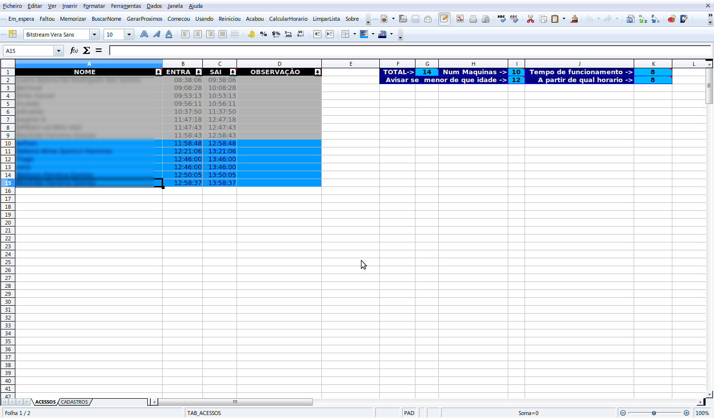
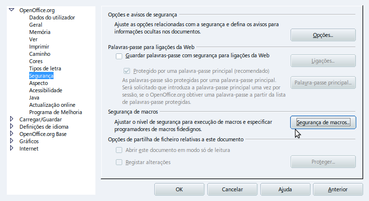
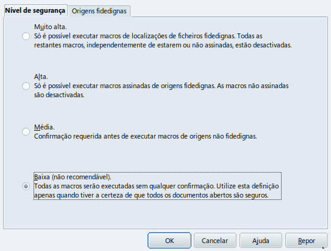

# Planilha do Monitor do Acessa

Esta planilha com recursos automáticos facilita o atendimento nos postos do Acessa SP. Pra quem é monitor do Acessa, vale a pena baixar e conferir :)

## Dica:
No Libre Office Calc (excel, rs) Vá em Ferramentas > Opções > Segurança e Configure ou desative a Segurança de Macros para poder funcionar a planilha.

## Prêmios

Esta planilha foi parte de um projeto na Rede de Projetos, do qual foi finalista em 2009! [Mais](http://rede.acessasp.sp.gov.br/materia/confira-os-finalistas-de-premio)

## Download

* [Link direto](https://github.com/edilqueirozdearaujo/planilha-do-monitor/raw/master/Planilha%20do%20Monitor.ods)
* [Baixar via Google Drive](https://drive.google.com/open?id=0B4RTTAL1BmqpNldTWE5Jc0xEUjg)
 

## Tutorial

Antigamente, na época então chamado de "Projeto Cadastro Offline", existia um tutorial. Como pouca coisa mudou, você pode se orientar por este guia de instruções. [Clique aquipara ver ou baixar (está no Google Drive)](https://drive.google.com/open?id=0B4RTTAL1BmqpZTNjYTAzOTItMmM2OC00MGNiLWJhN2EtOGEwZTA0ODE2ZGE1).
