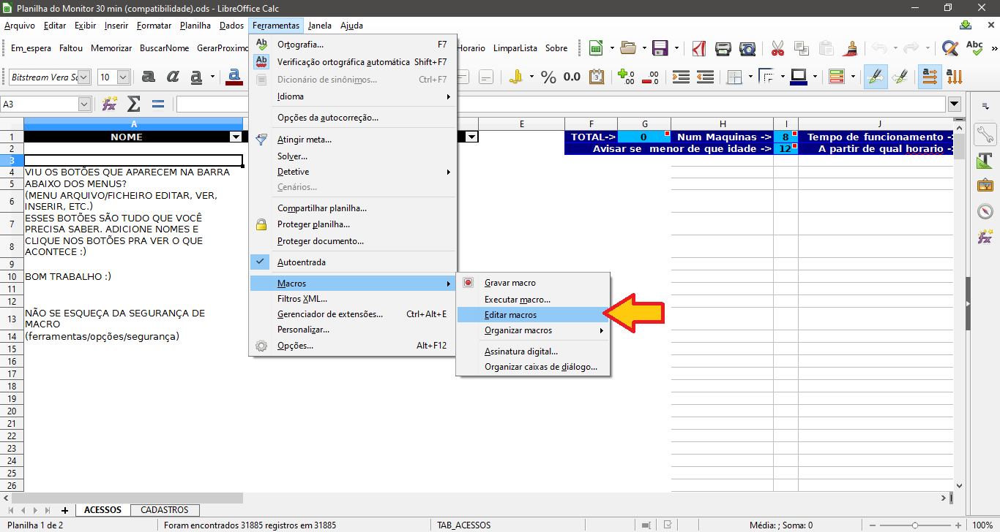
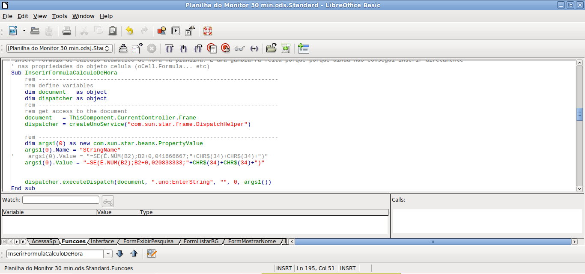

# Planilha do Monitor do Acessa

Esta planilha com recursos automáticos facilita o atendimento nos postos do Acessa SP. Pra quem é monitor do Acessa, vale a pena baixar e conferir :)

## Dica:
No Libre Office Calc (excel, rs) Vá em Ferramentas > Opções > Segurança e Configure ou desative a Segurança de Macros para poder funcionar a planilha.

## Prêmios

Esta planilha foi parte de um projeto na Rede de Projetos, do qual foi finalista em 2009! [Mais](http://rede.acessasp.sp.gov.br/materia/confira-os-finalistas-de-premio)

## Download

* [Versão 30 minutos](https://github.com/edilqueirozdearaujo/planilha-do-monitor/raw/master/Planilha%20do%20Monitor%2030%20min.ods)
* [Versão 60 minutos](https://github.com/edilqueirozdearaujo/planilha-do-monitor/raw/master/Planilha%20do%20Monitor%2060%20min.ods)
* [Versão 30 minutos (modo de compatibilidade - caso não seja Acessa SP)](https://github.com/edilqueirozdearaujo/planilha-do-monitor/raw/master/Planilha%20do%20Monitor%2030%20min%20(compatibilidade).ods)

 

## Tutorial

Antigamente, na época então chamado de "Projeto Cadastro Offline", existia um tutorial. Como pouca coisa mudou, você pode se orientar por este guia de instruções. [Clique aquipara ver ou baixar (está no Google Drive)](https://drive.google.com/open?id=0B4RTTAL1BmqpZTNjYTAzOTItMmM2OC00MGNiLWJhN2EtOGEwZTA0ODE2ZGE1).

## Ajustes
Caso precise alterar o código, vá no menu Ferramentas > Macro > Editar Macros. Escolha qualquer uma e edite.

Por exemplo, para ajustar a hora de 60 minutos para 30 minutos, procure pela função InserirFormulaDeHora e descomente a aspa simples da primeira linha e comente a segunda logo abaixo.

